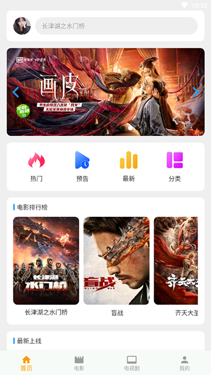
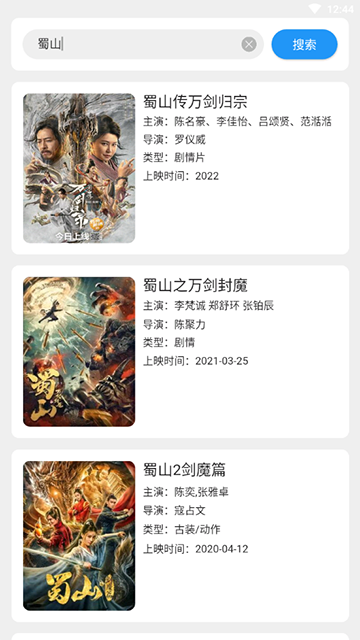

# react-native-app-ui
使用react-native开发的电影APP，所有数据来自第三方电影网站实时数据，包含首页，电影，电视剧，我的，登录，个人中心，电影详情页，播放页，搜索，缓存，浏览记录，播放记录等功能和模块，功能齐全，持续更新中......

开发者：吴怨吴悔

项目搭建时间：2020-08

=============================界面预览（如果无法预览图片，请查看项目根目录png文件）==========================

=============================界面预览（如果无法预览，请查看项目根目录png文件）==========================
启动命令：react-native run-android --no-jetifier

使用的插件

ui组件库：@ant-design/react-native: 4.0.5

缓存：@react-native-community/async-storage: 1.12.1

页面滚动：@react-native-community/viewpager": 4.1.6"

react：17.0.1

react-native：0.64.0

手势操作：react-native-gesture-handler: 1.8.0

滚动：react-native-pull: 2.0.2

屏幕相关：react-native-screens: 2.10.1

图标库：react-native-vector-icons: 7.0.0

webview：react-native-webview: 10.9.2

路由：react-navigation: 4.4.0

路由缓存：react-navigation-stack: 2.8.2

路由切换：react-navigation-tabs: 2.9.0

状态管理器：react-redux: 7.2.1

状态管理器：redux: 4.0.5

redux浏览器工具：reredux-devtools-extension: 2.13.8

redux状态管理器：redux-thunk: 2.3.0

flutter版本参见:    
通用地址：https://github.com/wuyuanwuhui99/flutter-movie-app-ui   
国内镜像地址：https://hub.nuaa.cf/wuyuanwuhui99/flutter-movie-app-ui   

在线音乐和电影后端接口项目和sql语句：   
通用地址：https://github.com/wuyuanwuhui99/springboot-app-service   
国内镜像地址：https://hub.nuaa.cf/wuyuanwuhui99/springboot-app-service   

harmony鸿蒙java版本参见: 
通用地址：https://github.com/wuyuanwuhui99/Harmony_movie_app_ui   
国内镜像地址：https://hub.nuaa.cf/wuyuanwuhui99/Harmony_movie_app_ui   

harmony鸿蒙arkts版本参见: 
通用地址：https://github.com/wuyuanwuhui99/Harmony-arkts-movie-music-app-ui   
国内镜像地址：https://hub.nuaa.cf/wuyuanwuhui99/Harmony-arkts-movie-music-app-ui      

java安卓原生版本参见：   
通用地址：https://github.com/wuyuanwuhui99/android-java-movie-app-ui   
国内镜像地址：https://hub.nuaa.cf/wuyuanwuhui99/android-java-movie-app-ui   

kotlin安卓原生版本参见：   
通用地址：https://github.com/wuyuanwuhui99/android-kotlin-jetpack-movie-app   
国内镜像地址：https://hub.nuaa.cf/wuyuanwuhui99/android-kotlin-jetpack-movie-app   

微信小程序版本参见：
通用地址: https://github.com/wuyuanwuhui99/weixin-movie-app-ui   
国内镜像地址：https://hub.nuaa.cf/wuyuanwuhui99/weixin-movie-app-ui   

uniapp版本参见： 
通用地址: https://github.com/wuyuanwuhui99/uniapp-vite-vue3-ts-movie-app-ui   
国内镜像地址：https://hub.nuaa.cf/wuyuanwuhui99/uniapp-vite-vue3-ts-movie-app-ui   

vue2在线音乐项目：
通用地址: https://github.com/wuyuanwuhui99/vue-music-app-ui   
国内镜像地址: https://hub.nuaa.cf/wuyuanwuhui99/vue-music-app-ui   

在线音乐后端项目：
通用地址: https://github.com/wuyuanwuhui99/koa2-music-app-service
国内镜像地址: https://hub.nuaa.cf/wuyuanwuhui99/koa2-music-app-service

vue3+ts明日头条项目：
通用地址: https://github.com/wuyuanwuhui99/vue3-ts-toutiao-app-ui   
国内镜像地址: https://hub.nuaa.cf/wuyuanwuhui99/vue3-ts-toutiao-app-ui   

使用token做登录验证，/service/movie/接口不需要验证，/service/movie-getway/接口需要token验证      

乐播放器正在开发中，音乐数据来自于python爬虫程序，爬取酷狗音乐数据，敬请关注   

接口和数据请在本地电脑中，暂时没有购买和部署服务器，仅限本地调试，如有需要调试请联系本人启动外网映射   

本站所有视频和图片均来自互联网收集而来，版权归原创者所有，本网站只提供web页面服务，并不提供资源存储，也不参与录制、上传 若本站收录的节目无意侵犯了贵司版权，请联系   

联系方式：（微信）wuwenqiang_99、（邮箱）275018723@qq.com
